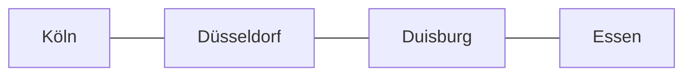

# SIGNAL//OPS

> A transparent, sprint-built DataOps platform for exploring weather and railway operations
> across the Rhine–Ruhr corridor.

[](https://www.python.org/)


Real-World Weather + Railway DataOps, developed one user-directed sprint at a time.

Sprints 1–5 established the architecture, real DWD ingestion, replayable SQLite storage, a shared
data model, and inspectable quality checks. Sprint 6 scopes the case study to four city profiles:
**Duisburg, Essen, Düsseldorf, and Köln**. DB credentials and the Timetables subscription are now
working. Planned and current railway events are now matched, but cross-source analysis remains
unfinished until the weather archive overlaps the saved railway hour.



## Quick start

Prerequisite: Python 3.11 or newer. On the current Mac, `python3.13` is available and was used for
verification.

```bash
cd ~/Desktop/SIGNAL-OPS
PYTHONPATH=src python3.13 -m signalops status --config config/base.toml
PYTHONPATH=src python3.13 -m unittest discover -s tests -v
```

The tests use only the standard library, so the commands above require no package downloads. For
an editable development installation, optionally run:

```bash
python3.13 -m venv .venv
source .venv/bin/activate
python -m pip install -e '.[dev]'
signalops status
```

The status command is safe: it displays configuration readiness and does not call either API.

Preview or run the first-source downloads:

```bash
# Preview only: no network request and no file creation
PYTHONPATH=src python3.13 -m signalops ingest --source dwd --dry-run

# Download the public DWD archive and store it under data/raw/
PYTHONPATH=src python3.13 -m signalops ingest --source dwd --city essen

# DB works the same way after DB_API_CLIENT_ID and DB_API_KEY are exported
PYTHONPATH=src python3.13 -m signalops ingest --source db --city duisburg --dry-run

# Capture the current full-change feed for delay and cancellation evidence
PYTHONPATH=src python3.13 -m signalops ingest --source db --city duisburg --db-feed changes

# Verify and load a previously saved raw artifact into SQLite
PYTHONPATH=src python3.13 -m signalops replay data/raw/dwd/YYYY-MM-DD/FILE.zip

# Build canonical observations, then assess the latest imported DWD artifact
PYTHONPATH=src python3.13 -m signalops normalize --dataset dwd_weather
PYTHONPATH=src python3.13 -m signalops quality --dataset dwd_weather --city essen

# The default database is the active Rhine–Ruhr case study
PYTHONPATH=src python3.13 -m signalops analyze

# The earlier Berlin proof remains available through an explicit override
SIGNALOPS_DATA_DIR=data PYTHONPATH=src python3.13 -m signalops status
```

To use a non-default data directory or provide DB credentials, export the variables shown in
`.env.example`. Secrets belong in the shell, a local `.env`, or a secret manager—never in Git.

## Repository map

```text
config/                 versioned, non-secret settings
docs/                   architecture and sprint record
src/signalops/domain/   source-independent records and run results
src/signalops/ports/    contracts for data sources and sinks
src/signalops/adapters/ DWD and Deutsche Bahn boundary implementations
src/signalops/          configuration, orchestration, and CLI
tests/                  offline unit tests with deterministic fakes
```

## Project documentation

| Document | Purpose |
|---|---|
| [Roadmap](docs/ROADMAP.md) | Full delivery map, sprint checklists, milestones, and release path |
| [Build and architecture log](docs/BUILD_LOG.md) | Decisions, completed work, verification, and current limitations |
| [Data sources](docs/SOURCES.md) | Official contracts, access notes, and attribution |
| [Documentation hub](docs/README.md) | How planning and sprint updates are organized |
| [Sprint update template](docs/sprints/SPRINT_TEMPLATE.md) | Repeatable format for every future sprint |
| [Sprint 2 record](docs/sprints/SPRINT-02-FIRST-INGESTION.md) | First-source ingestion and resolved DB access gate |
| [Sprint 3 record](docs/sprints/SPRINT-03-STORAGE-REPLAY.md) | SQLite schema, replay behavior, and verification evidence |
| [Sprint 4 record](docs/sprints/SPRINT-04-UNIVERSAL-MODEL.md) | Shared entities, observations, events, and lineage |
| [Sprint 5 record](docs/sprints/SPRINT-05-DATA-QUALITY.md) | Quality rules, observed findings, and schema-drift limits |
| [Sprint 6 record](docs/sprints/SPRINT-06-RHINE-RUHR-SCOPE.md) | Four-city scope, verified station map, and remaining analysis gate |
| [Regional data profile](docs/analysis/RHINE_RUHR_DATA_PROFILE.md) | Measured coverage, quality findings, and current join limitation |
| [Data dictionary](docs/DATA_DICTIONARY.md) | Canonical tables and city-hour export fields |
| [Vision implementation map](docs/VISION_IMPLEMENTATION.md) | Requirement-by-requirement implementation truth |

## Data sources

- DWD Open Data / Climate Data Center: public HTTPS data for four configured weather stations.
- Deutsche Bahn Timetables API: four verified Hauptbahnhof profiles; credentials stay external.

The checked-in URLs are configuration defaults, not a claim that availability or API contracts
will never change. Sprint 2 validated the official contracts and recorded one reproducible DWD
sample; Sprint 6 verified authenticated DB access and introduced the regional profiles.

## Current boundary

The regional database now contains verified DWD observations plus planned and changed DB events
for all four cities. The rail-only export can describe matched delays and cancellations for the
saved slice. The source dates still do not overlap: weather ends on 2026-09-13 while rail begins on
2026-09-14, so the export correctly reports zero paired city-hours. No weather relationship,
causal result, dashboard, or production metric is presented as complete.
