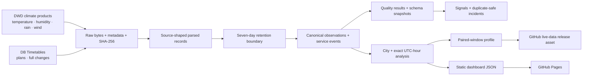

# Architecture and data lineage

Every canonical row carries an import identifier. Every import records the source, dataset stream,
station scope, retrieval time, raw path, checksum and record count. Missing weather or railway data
remains missing; it is never converted to zero. The immutable `evidence/` bundle is separate from
the rolling operational database and is not removed by retention.
