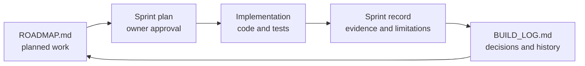

# SIGNAL//OPS documentation

This folder is the project knowledge base and is ready to render directly on GitHub. It can also
be copied into a GitHub Wiki later without changing the source-of-truth workflow.

## Start here

| If you want to… | Read… |
|---|---|
| See the complete product journey | [Roadmap](ROADMAP.md) |
| Understand architectural choices | [Build and architecture log](BUILD_LOG.md) |
| Check source contracts and attribution | [Data sources](SOURCES.md) |
| See exactly what Sprint 1 delivered | [Sprint 1 record](sprints/SPRINT-01-FOUNDATION.md) |
| Review current Sprint 2 progress | [Sprint 2 record](sprints/SPRINT-02-FIRST-INGESTION.md) |
| Review Sprint 3 storage and replay | [Sprint 3 record](sprints/SPRINT-03-STORAGE-REPLAY.md) |
| Track every vision requirement | [Vision implementation map](VISION_IMPLEMENTATION.md) |
| Review the universal model | [Sprint 4 record](sprints/SPRINT-04-UNIVERSAL-MODEL.md) |
| Review data-quality evidence | [Sprint 5 record](sprints/SPRINT-05-DATA-QUALITY.md) |
| Review the Rhine–Ruhr scope | [Sprint 6 record](sprints/SPRINT-06-RHINE-RUHR-SCOPE.md) |
| Prepare the next sprint update | [Sprint template](sprints/SPRINT_TEMPLATE.md) |

## Documentation model

- The **roadmap** is forward-looking. Unchecked items are plans, not promises or completed work.
- A **sprint record** captures scope, task-level checkboxes, verification, and handoff.
- The **build log** is chronological and factual. It records accepted decisions and observed
  results only.
- The root **README** remains concise and recruiter-friendly.

## Update rules

At the start of every sprint:

1. Confirm the sprint scope with the project owner.
2. Copy `sprints/SPRINT_TEMPLATE.md` to a numbered sprint file.
3. Move only approved roadmap items into the sprint file.
4. Record any new architectural decision before implementation depends on it.

At the end of every sprint:

1. Check off only work that is implemented and verified.
2. Record exact commands and observed results—never estimated production metrics.
3. Document deferred work, known limitations, and risks.
4. Update roadmap status and the root README.
5. Stop for owner review before starting another sprint.
