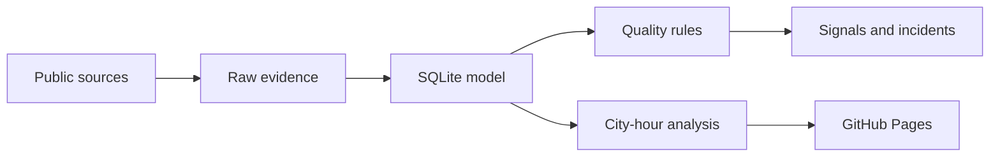

# Roadmap

`PROJECT_VISION.md` is the unchanged long-term brief. This roadmap turns that vision into smaller
releases; it does not remove any requirement from it.

## Current state — 0.5.0

| Area | Status |
|---|---|
| DWD and DB ingestion | Complete for four Rhine–Ruhr cities, including rain and wind |
| Replay and canonical storage | Complete |
| Data-quality rules and schema checks | Complete for version 0.5 scope |
| DB plan/change matching | Complete for the saved railway slice |
| Static dashboard and CI | Complete |
| Weather × railway comparison | Waiting for overlapping source hours |
| External collaboration tools | Templates only |

## Version 1.0 — finish the case study

### Data

- [ ] Collect a DWD archive covering the saved DB timetable hour.
- [ ] Rebuild the city-hour export with at least one paired hour per city.
- [x] Implement generated missingness, condition, sample-size, and selection-limit profiling.
- [x] Prevent causal claims in generated profile and dashboard copy.

### Operations

- [x] Detect delay, cancellation, stale-source, and schema-change signals.
- [x] Store duplicate-safe local incidents.
- [x] Add one controlled failure and documented recovery.
- [x] Add short runbooks for source, credential, schema, replay, and overlap failures.

### Web and automation

- [x] Publish the static dashboard with GitHub Pages.
- [x] Verify Python 3.11–3.13 in GitHub Actions.
- [x] Rebuild dashboard data from committed evidence before deployment.
- [x] Keep scheduled collection credentials in GitHub Secrets.
- [x] Verify live DWD and DB collection in GitHub Actions.
- [x] Add an end-to-end test for evidence rebuild and dashboard generation.
- [x] Add automated keyboard-structure, mobile, and reduced-motion checks plus release checklist.
- [x] Add a dashboard screenshot to the README.

### Release

- [ ] Reconcile every public number with the committed evidence.
- [x] Add repeatable secret, licence, dependency, claim, and integrity checks.
- [x] Add a concise demo script and architecture/lineage diagram.
- [ ] Tag `v1.0.0` and publish release notes.

## Later releases

All items below come from the long-term vision and remain in scope.

### 1.1 — reliability

- Durable run history beyond Actions cache retention.
- Recovery tests, actionable notifications, and reviewed correction import.
- Stronger raw-contract checks for DWD files and DB XML.
- Source/API health history with documented service targets.

### 2.0 — energy mission

- Add a verified SMARD adapter and normalized energy time series.
- Implement interval uniqueness, unit validity, and timeline continuity.
- Add price, residual-load, and forecast-deviation signals.
- Measure which existing platform components are genuinely reusable.

### 2.1 — air-quality mission

- Add a verified UBA adapter and station catalogue.
- Implement measurement, station, unit, and missing-data checks.
- Add PM10 and NO2 investigation views and signals.

### 3.0 — multi-domain operations

- Add Destatis and revision-aware public-statistics ingestion.
- Add a combined source-health and incident view.
- Add actions, decisions, ownership, and operational KPI history.
- Add a hosted query API if the static interface is no longer sufficient.
- Evaluate a numeric trust score only with documented, validated weights.
- Improve source onboarding while retaining adapter-specific code and tests.

## Supporting tools

Excel, Power BI, Jira, Confluence, and Miro remain presentation and collaboration outputs. They do
not sit in the runtime path. Version 1 requires only small, reviewable examples; fuller automation
belongs in later releases.

## Completed sprint record

| Sprint | Result | Detail |
|---:|---|---|
| 1 | Foundation | Package, configuration, ports, and tests |
| 2 | Source access | DWD and DB adapters with preserved raw files |
| 3 | Replay | Idempotent SQLite imports and lineage |
| 4 | Canonical model | Sources, entities, observations, and railway events |
| 5 | Quality | Persisted rules, affected records, and schema snapshots |
| 6 | Rhine–Ruhr | Four-city data, plan/change matching, analysis, and Pages preview |
| 7 | Overlap readiness | Active: rolling collection, fail-closed publication, and paired-data gate |

Detailed sprint records remain under `docs/sprints/` as implementation history.
