# SIGNAL//OPS roadmap

> Status: **Sprint 6 active · Rhine–Ruhr city profiles implemented**

This roadmap shows the complete intended journey from a tested Python foundation to a
recruiter-ready Weather × Railway DataOps case study. It is a living plan: later sprint scope may
change after source validation and user review. An unchecked box means planned—not implemented.

## North-star outcome

Build a reproducible system that can answer a defensible question:

> What observable relationships exist between weather conditions and railway operations for a
> clearly defined place and time window?

The project will preserve raw-source provenance, distinguish observed facts from derived results,
and avoid causal claims that the available data cannot support.

## Delivery map

```mermaid
flowchart LR
    S1["✅ Sprint 1<br/>Foundation"] --> S2["✅ Sprint 2<br/>Live source access"]
    S2 --> S3["✅ Sprint 3<br/>Storage"]
    S3 --> S4["✅ Sprint 4<br/>Canonical model"]
    S4 --> S5["✅ Sprint 5<br/>Data quality"]
    S5 --> S6["🟡 Sprint 6<br/>Rhine–Ruhr analysis"]
    S6 --> S7["⬜ Sprint 7<br/>Operations"]
    S7 --> S8["⬜ Sprint 8<br/>Analytics UX"]
    S8 --> S9["⬜ Sprint 9<br/>Automation"]
    S9 --> S10["⬜ Sprint 10<br/>Portfolio release"]
```

## Milestone view

| Milestone | Sprints | Outcome | Status |
|---|---:|---|---|
| M1 — Trustworthy foundation | 1–2 | Tested architecture and first reproducible source pulls | In progress |
| M2 — Governed data product | 3–5 | Durable layers, shared model, and evidence-backed quality rules | Complete for DWD |
| M3 — Operational insight | 6–7 | Joined Weather × Rail analysis and incident workflow | Planned |
| M4 — Recruiter-ready product | 8–10 | Usable reporting, automation, documentation, and demo narrative | Planned |

## Sprint 1 — Foundation

**Status:** ✅ Complete  
**Record:** [Sprint 1 — Foundation](sprints/SPRINT-01-FOUNDATION.md)  
**Objective:** Establish a runnable architecture whose core logic is independent of DWD, Deutsche
Bahn, HTTP libraries, and storage technologies.

- [x] Create an installable Python 3.11+ package using a `src` layout.
- [x] Define typed, immutable raw-record and ingestion-result models.
- [x] Define source-adapter and record-sink boundaries.
- [x] Add DWD and DB adapter shells with explicit readiness behavior.
- [x] Load non-secret TOML configuration with environment-variable overrides.
- [x] Keep DB credentials outside version control.
- [x] Add source-independent ingestion orchestration.
- [x] Add a no-network status command.
- [x] Add deterministic offline tests.
- [x] Initialize Git with `main` as the initial branch.
- [x] Document architecture, setup, limitations, and next steps.

**Exit evidence:** six offline tests pass; status reports DWD configuration ready, DB credentials
required, and confirms that no network calls were made.

## Sprint 2 — First real ingestion

**Status:** ✅ Complete  
**Record:** [Sprint 2 — First real ingestion](sprints/SPRINT-02-FIRST-INGESTION.md)  
**Objective:** Retrieve one deliberately narrow, reproducible slice from each real source and
preserve the responses with provenance.

- [x] Verify current official DWD and DB contracts, terms, authentication, and rate limits.
- [x] Select one DWD station/product and one DB station/time window.
- [x] Introduce an HTTP boundary with timeouts, bounded retries, and typed failures.
- [x] Implement DWD download and parsing for the approved slice.
- [x] Implement DB planned-timetable retrieval and XML parsing for the approved slice.
- [x] Add atomic raw-response storage with retrieval metadata and checksums.
- [x] Add small source fixtures and parser/contract tests.
- [x] Add `signalops ingest --source ...` and a safe dry-run mode.
- [x] Run and record a permitted live DWD ingestion.
- [x] Run and record a permitted live DB ingestion after subscribing the application.

**Exit gate:** both sources produce reproducible raw artifacts or the sprint records a verified
source limitation and an owner-approved alternative.

## Sprint 3 — Durable storage and replay

**Status:** ✅ Complete  
**Record:** [Sprint 3 — Storage and replay](sprints/SPRINT-03-STORAGE-REPLAY.md)  
**Objective:** Make ingested data durable, queryable, idempotent, and replayable.

- [x] Choose SQLite after inspecting the real DWD and fixture DB payloads.
- [x] Keep raw bytes separate from parsed, source-shaped staged records.
- [x] Record artifact checksum, source timestamps, local path, and imported row count.
- [x] Prevent duplicate replay using source plus SHA-256 identity.
- [x] Create a small version-one schema using standard SQLite DDL.
- [x] Add a replay command that verifies but never mutates raw artifacts.
- [x] Test checksum failure, duplicate records, version retention, and transaction rollback.

**Exit gate:** the same raw input can be replayed deterministically without duplication or loss.

**Exit evidence:** the real DWD artifact inserted 13,200 staged records on first replay and zero on
the second; SQLite retained one artifact import and 13,200 records.

## Sprint 4 — Canonical Weather × Railway model

**Status:** ✅ Complete for DWD; DB model fixture-tested  
**Record:** [Sprint 4 — Universal model](sprints/SPRINT-04-UNIVERSAL-MODEL.md)  
**Objective:** Normalize heterogeneous source payloads into documented analytical entities.

- [x] Define source, dataset, station entity, observation, and service-event tables.
- [x] Preserve source payloads alongside normalized values and units.
- [x] Standardize DWD observation timestamps in UTC.
- [ ] Resolve DWD and rail locations using a documented spatial matching rule.
- [x] Link canonical rows to dataset, entity, and artifact import IDs.
- [x] Add unit, boundary, and representative fixture tests.
- [ ] Publish a data dictionary and example lineage trace.

**Exit gate:** a reviewer can trace every curated value back to its raw source and transformation.

## Sprint 5 — Data-quality and trust layer

**Status:** ✅ Complete for DWD; DB live evidence pending  
**Record:** [Sprint 5 — Data quality and schema drift](sprints/SPRINT-05-DATA-QUALITY.md)  
**Objective:** Detect and explain whether the data is fit for analysis.

- [x] Define quality dimensions: validity, completeness, uniqueness, freshness, and consistency.
- [x] Implement DWD-specific and shared validation rules.
- [x] Classify results as pass, warning, or failure with reasons and counts.
- [x] Store rule results and affected record identifiers.
- [x] Add parsed-schema drift and stale-observation detection.
- [x] Review trust scoring and deliberately omit an unjustified numeric formula.
- [x] Add tests for known bad data and boundary conditions.
- [ ] Verify DB quality behavior with a real permitted timetable artifact.

**Exit evidence:** the real DWD import has eight inspectable rule results and 73 linked affected
record identifiers; no unsupported quality percentage is presented as fact.

## Sprint 6 — Rhine–Ruhr Weather × Railway analysis

**Status:** 🟡 Active  
**Record:** [Sprint 6 — Rhine–Ruhr scope](sprints/SPRINT-06-RHINE-RUHR-SCOPE.md)  
**Objective:** Produce a reproducible descriptive analysis of the joined sources.

- [x] Scope the project to Duisburg, Essen, Düsseldorf, and Köln.
- [x] Verify four DB Hauptbahnhof EVA numbers through the live station endpoint.
- [x] Verify four active DWD hourly-temperature archives.
- [x] Add one selectable city option shared by both adapters.
- [x] Preserve city/station provenance through raw save and replay.
- [x] Route canonical records to the correct city entity.
- [x] Capture, replay, and normalize one non-empty DB plan slice for all four cities.
- [x] Capture, replay, and normalize the four current DWD archives in an isolated database.
- [x] Run quality checks separately by source and city.
- [x] Define the city-hour grain and exact UTC-hour matching rule.
- [x] Export unmatched source-hours without converting missing rail data to zero.
- [ ] Collect an overlapping date before calculating Weather × Railway results.
- [ ] Define the final analytical question and evaluation window before calculating results.
- [ ] Establish baselines and comparison groups.
- [ ] Join sources with documented spatial and temporal tolerances.
- [ ] Explore missingness, coverage, outliers, and selection bias.
- [ ] Calculate only metrics supported by retrieved data.
- [ ] Separate association from causal interpretation.
- [ ] Produce reproducible tables and visual-ready datasets.

**Exit gate:** all findings link to code, source data, assumptions, and quality caveats.

## Sprint 7 — Operational workflow

**Status:** ⬜ Planned  
**Objective:** Turn failed or degraded data runs into an explainable operating process.

- [ ] Define run states, severity levels, and incident triggers.
- [ ] Add structured logs and correlation/run identifiers.
- [ ] Create an incident record and lifecycle.
- [ ] Write runbooks for source outage, credential failure, drift, and replay.
- [ ] Add a decision log and ownership model.
- [ ] Design optional Jira/Confluence mappings without making them runtime dependencies.
- [ ] Demonstrate one controlled failure and recovery scenario.

**Exit gate:** a new operator can diagnose a simulated failure using only repository artifacts.

## Sprint 8 — Analytics and review experience

**Status:** ⬜ Planned  
**Objective:** Present source health, quality, and Weather × Rail findings clearly.

- [ ] Define audiences and decisions for each page before choosing visuals.
- [ ] Build an overview, data-quality, and investigation experience.
- [ ] Add filters for time, location, source, and quality state.
- [ ] Include metric definitions, refresh timestamps, and caveats.
- [ ] Add an exportable review queue for investigation workflows.
- [ ] Validate accessibility, readability, and screenshot quality.
- [ ] Record the chosen delivery tool after user approval.

**Exit gate:** the interface answers its defined questions without hiding uncertainty or provenance.

## Sprint 9 — Automation and reliability

**Status:** ⬜ Planned  
**Objective:** Make verification and scheduled operation repeatable.

- [ ] Add CI for tests, linting, and packaging checks.
- [ ] Add unit, contract, integration, and end-to-end test boundaries.
- [ ] Add scheduled local or hosted runs only after deployment scope is approved.
- [ ] Add secrets-safe runtime configuration.
- [ ] Add health checks and actionable failure notifications.
- [ ] Document backup, retention, and recovery expectations.
- [ ] Measure runtime behavior from actual runs before setting targets.

**Exit gate:** a clean checkout can be verified automatically, and operational failures are visible.

## Sprint 10 — Portfolio release

**Status:** ⬜ Planned  
**Objective:** Package the work as a technically credible, easy-to-demo case study.

- [ ] Finalize architecture and lineage diagrams.
- [ ] Add verified screenshots or a short demo walkthrough.
- [ ] Publish a concise problem → approach → evidence → limitation narrative.
- [ ] Document reproducible demo setup and teardown.
- [ ] Perform security, licensing, privacy, and secret scans.
- [ ] Create tagged release notes and a changelog.
- [ ] Prepare defensible CV bullets and an interview walkthrough.
- [ ] Complete a final claim-versus-evidence audit.

**Exit gate:** every public claim is reproducible, attributable, and explainable in an interview.

## Candidate parking lot

These ideas are intentionally outside the committed sprint sequence. They require user approval
and evidence that they add value.

- [ ] Additional weather stations, rail locations, or longer time ranges.
- [ ] Additional domains such as energy, air quality, or economic indicators.
- [ ] PostgreSQL or cloud deployment.
- [ ] Advanced anomaly detection or forecasting.
- [ ] Automated Jira/Confluence integration.
- [ ] Public hosted demo.

## How roadmap updates work

1. The project owner selects and approves one sprint.
2. The sprint gets its own file under `docs/sprints/` using the template.
3. Work is implemented and verified; checkboxes change only when evidence exists.
4. Scope changes are recorded under **Changes from plan**, not silently rewritten.
5. Results and architectural decisions are appended to `BUILD_LOG.md`.
6. This roadmap is updated with status and links.
7. Work stops at the sprint boundary for owner review.

## Status legend

- ✅ **Complete** — implemented and verified.
- 🟡 **Active** — explicitly approved and currently in progress.
- ⬜ **Planned** — proposed future work; not yet started.
- ⏸️ **Deferred** — consciously moved out of the current delivery sequence.
- ⚠️ **Blocked** — cannot proceed without a documented dependency or decision.
