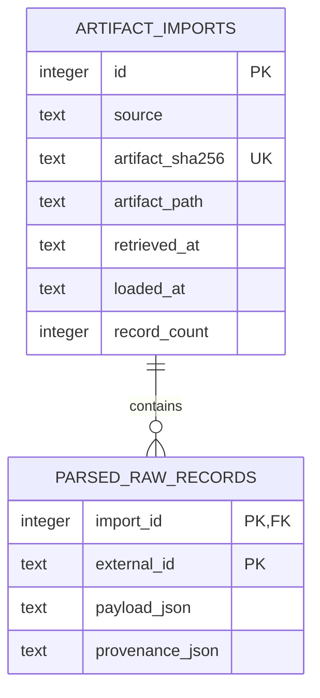

# Sprint 3 — Durable storage and replay

**Status:** ✅ Complete  
**Date:** 2026-09-14  
**Theme:** Make preserved source responses verifiable, replayable, and idempotent.

## Sprint goal

Load parsed, source-shaped records from an already saved artifact into a small local database
without downloading again, mutating raw files, or duplicating an identical import.

## Scope checklist

- [x] Verify raw byte count and SHA-256 before parsing.
- [x] Add `signalops replay PATH` with no HTTP activity.
- [x] Store data in a local SQLite file using the standard library.
- [x] Keep artifact imports separate from parsed raw records.
- [x] Identify an artifact by source and checksum, not its mutable upstream filename.
- [x] Keep a changed daily artifact as a separate record version.
- [x] Make repeated replay of identical bytes a no-op.
- [x] Roll back the complete import when duplicate record IDs violate the source contract.
- [x] Reject DWD rows whose station ID differs from configured station `00433`.
- [x] Add focused storage, checksum, replay, and rollback tests.

## Schema



These are **parsed raw records**, not canonical weather observations or railway events. Their JSON
payloads still follow source-shaped fields. Canonical modeling belongs to Sprint 4.

## Verification evidence

The complete offline suite ran successfully:

```text
19 tests ran and passed.
```

The real DWD artifact from Sprint 2 was replayed twice:

| Observation | First replay | Second replay |
|---|---:|---:|
| Records seen | 13,200 | 13,200 |
| New records inserted | 13,200 | 0 |

Database inspection after both commands showed one artifact import and 13,200 parsed raw records.
These are observed counts from one local verification, not production KPIs.

## Deliberately deferred

- Canonical weather and railway tables.
- Cross-artifact overlap resolution and current-state selection.
- ORM, Alembic, PostgreSQL, concurrency tuning, or cloud storage.
- Directory-wide batch replay and retention automation.
- Query APIs, dashboards, and performance targets.

## Changes from plan

Sprint 3 proceeded with the live DWD artifact and fixture-tested DB parser after the owner asked for
autonomous sequential work. The open live DB verification remains visible; no DB result is claimed.

## Handoff

Sprint 3 is complete. Sprint 4 needs a real DB XML artifact to design the railway side of the
canonical model from evidence rather than assumptions.
