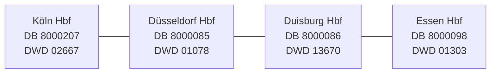

# Sprint 6 — Rhine–Ruhr scope and analysis

**Status:** Active  
**Theme:** Weather × railway operations across Duisburg, Essen, Düsseldorf, and Köln

## Goal

Turn the earlier one-station proof into a small regional case study without adding a framework or
claiming results before real source data supports them.

## Regional map



The diagram shows project scope, not a claim about exact train routing. DWD stations represent the
city area and are not measurements taken at the railway platforms. Köln uses the active Köln/Bonn
weather station.

## Completed foundation

- [x] Verify each DB station with `GET /station/{pattern}`.
- [x] Verify each DWD station in the current hourly-temperature catalogue.
- [x] Confirm that all four DWD recent archive URLs return successfully.
- [x] Add the four profiles to `config/base.toml`.
- [x] Add `ingest --city CITY` for both sources.
- [x] Keep Essen as the simple default profile.
- [x] Preserve station identity in raw metadata and replay.
- [x] Map staged records to the correct canonical entity.
- [x] Reject unknown city names clearly.
- [x] Keep API credentials outside Git.

## Still to do in Sprint 6

- [x] Capture non-empty DB plan data for all four cities.
- [x] Capture current DWD archives for all four profiles.
- [x] Replay and normalize the new regional artifacts in a clean Rhine–Ruhr database.
- [x] Define city-hour grain and exact UTC-hour matching.
- [x] Run quality checks separately by source and city.
- [x] Export source hours while preserving unavailable values as null.
- [x] Record limitations and avoid causal language.
- [ ] Collect overlapping weather and rail hours.
- [ ] Produce paired descriptive Weather × Railway results.

## Commands

```bash
cd ~/Desktop/SIGNAL-OPS
export SIGNALOPS_DATA_DIR=data/rhine_ruhr

# Safe previews
PYTHONPATH=src python3.13 -m signalops ingest --source db --city koeln --dry-run
PYTHONPATH=src python3.13 -m signalops ingest --source dwd --city duisburg --dry-run

# Real downloads
PYTHONPATH=src python3.13 -m signalops ingest --source db --city essen
PYTHONPATH=src python3.13 -m signalops ingest --source dwd --city duesseldorf
```

Valid city keys are `duisburg`, `essen`, `duesseldorf`, and `koeln`.

## Verification

- Full offline suite: 36 tests pass.
- Live DB subscription: verified.
- Live DB rail records: 241 raw stop records and 353 normalized planned events across four cities.
- Live DWD archive availability: verified with HTTP success for all four configured station files.
- Live DWD records: 52,800 hourly source rows and 105,600 canonical observations.
- Join coverage: zero paired city-hours because the two retrieved date ranges do not overlap.

## Exit gate

Sprint 6 is complete only when an overlapping source window supports a documented descriptive
analysis. Until then, the sprint remains active.
