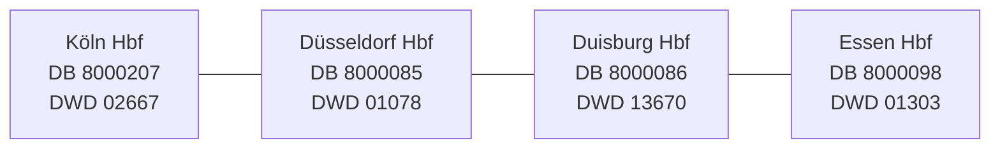

# Sprint 6 — Rhine–Ruhr scope and analysis

**Status:** Active  
**Theme:** Weather × railway operations across Duisburg, Essen, Düsseldorf, and Köln

## Goal

Turn the earlier one-station proof into a small regional case study without adding a framework or
claiming results before real source data supports them.

## Regional map



The diagram shows project scope, not a claim about exact train routing. DWD stations represent the
city area and are not measurements taken at the railway platforms. Köln uses the active Köln/Bonn
weather station.

## Completed foundation

- [x] Verify each DB station with `GET /station/{pattern}`.
- [x] Verify each DWD station in the current hourly-temperature catalogue.
- [x] Confirm that all four DWD recent archive URLs return successfully.
- [x] Add the four profiles to `config/base.toml`.
- [x] Add `ingest --city CITY` for both sources.
- [x] Keep Essen as the simple default profile.
- [x] Preserve station identity in raw metadata and replay.
- [x] Map staged records to the correct canonical entity.
- [x] Reject unknown city names clearly.
- [x] Keep API credentials outside Git.

## Still to do in Sprint 6

- [x] Capture non-empty DB plan data for all four cities.
- [x] Capture current DWD archives for all four profiles.
- [x] Replay and normalize the new regional artifacts in a clean Rhine–Ruhr database.
- [x] Define city-hour grain and exact UTC-hour matching.
- [x] Run quality checks separately by source and city.
- [x] Export source hours while preserving unavailable values as null.
- [x] Record limitations and avoid causal language.
- [x] Capture and normalize one DB full-change snapshot for all four cities.
- [x] Match plans to changes by station, stop ID, and event type.
- [x] Keep multiple plan hours instead of treating the latest import as a full replacement.
- [x] Define the analytical question, window rule, baseline, and comparison groups.
- [ ] Collect overlapping weather and rail hours.
- [ ] Produce paired descriptive Weather × Railway results.

## Commands

```bash
cd ~/Desktop/SIGNAL-OPS

# Safe previews
PYTHONPATH=src python3.13 -m signalops ingest --source db --city koeln --dry-run
PYTHONPATH=src python3.13 -m signalops ingest --source dwd --city duisburg --dry-run

# Real downloads
PYTHONPATH=src python3.13 -m signalops ingest --source db --city essen
PYTHONPATH=src python3.13 -m signalops ingest --source db --city essen --db-feed changes
PYTHONPATH=src python3.13 -m signalops ingest --source dwd --city duesseldorf
```

Valid city keys are `duisburg`, `essen`, `duesseldorf`, and `koeln`.
The base configuration now uses `data/rhine_ruhr` by default. Set
`SIGNALOPS_DATA_DIR=data` only when inspecting the earlier Berlin proof.

## Verification

- Full offline suite: 40 tests pass.
- Live DB subscription: verified.
- Live DB rail records: 241 raw stop records and 353 normalized planned events across four cities.
- Live DB change records: 2,599 raw stops and 3,564 normalized event updates.
- Exact-key reconciliation: 331 of the 353 saved plans have a matching current event; unmatched
  changes outside the saved plan slice are excluded from delay metrics.
- Live DWD archive availability: verified with HTTP success for all four configured station files.
- Live DWD records: 52,800 hourly source rows and 105,600 canonical observations.
- Join coverage: zero paired city-hours because the two retrieved date ranges do not overlap.

## Analysis contract

**Question:** Across valid paired city-hours, how do positive railway delays and cancellations vary
with observed air temperature and relative humidity?

**Window:** Use only the intersection of available DWD and DB hours after quality checks. The
window begins with the first paired hour and ends with the last paired hour; it is not filled with
zeros outside source coverage.

**Matching:** Each configured DWD station is a city-area proxy for its configured Hauptbahnhof.
Records match on the same city key and exact UTC hour. This is an association design, not evidence
that weather was measured at the platform or caused a railway outcome. Köln/Bonn is explicitly an
airport-area proxy and needs special caution.

**Rail denominator:** Delay and cancellation calculations include only planned events with an
exact matching change event for the same station, DB stop ID, and arrival/departure type. A delay
is a positive difference between changed and planned time. Missing change rows are not interpreted
as on-time services, and unmatched changes are not interpreted as cancellations.

**Baseline and comparisons:** Each city's full valid paired window is its baseline. Exploratory
weather comparisons use within-city temperature and humidity groups, then report the number of
paired hours and matched railway events in every group. Cross-city differences remain descriptive.

## Exit gate

Sprint 6 is complete only when an overlapping source window supports a documented descriptive
analysis. Until then, the sprint remains active.
