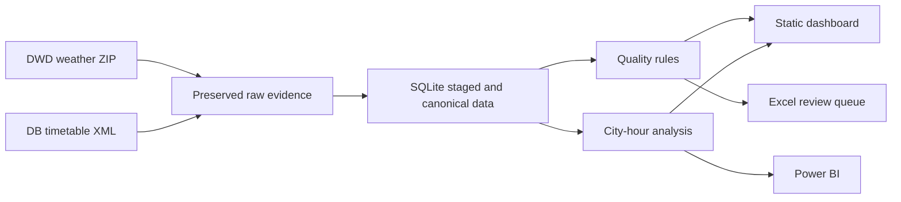
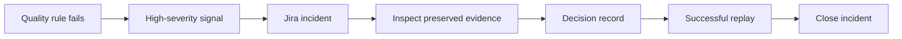

# Miro board blueprint

Create one board named `SIGNAL OPS — Version 1.0` with the following four frames. Export the final
board to PDF or PNG and keep the export with the release evidence.

## Frame 1 — Architecture

## Frame 2 — Lineage

Show one weather value and one railway event from source URL and retrieval time through raw file,
import identifier, canonical row, city-hour calculation, and displayed metric.

## Frame 3 — Incident lifecycle

## Frame 4 — Source onboarding

Answer: publisher, licence, access method, entity, timestamp, expected change, failure modes,
quality rules, useful signals, required normalizer, fixture, and owner. Completing this frame does
not imply that a source can be added without code.
